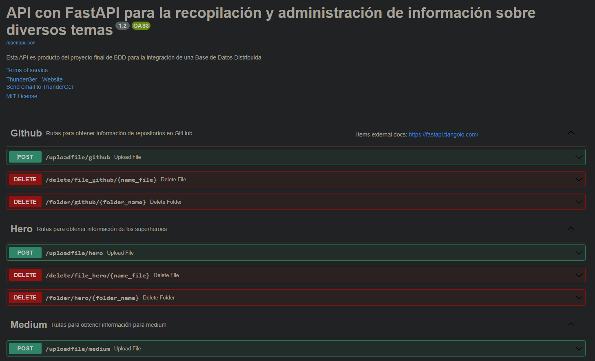
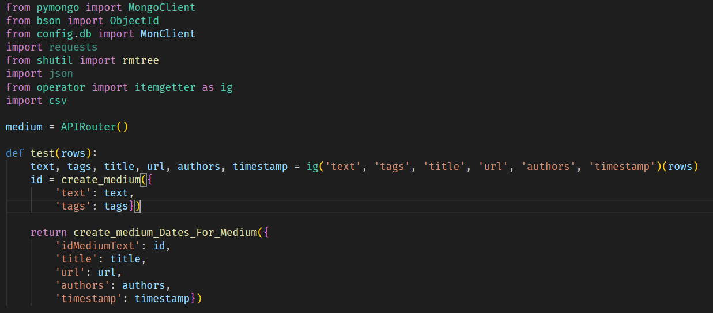

# Base de datos distribuida con el uso de bot de Telegram

_Diseñar una base de datos distribuida que ocupe diferentes sistemas de gestión al menos un NoSQL y un SQL.
Diseñar los bots (uno de telegram y uno de discord) mediante los cuales los usuarios obtendrán acceso a la base de datos distribuida._

## Comenzando 🚀

_Este proyecto es desarrollado para la clase de Base de datos distribuidas en el cual se implementara el uso de un bot Telegram para hacer consultas en la base de datos._


### Pre-requisitos 📋

**Requisitos Desarrollador**
Nesesitaras: 
* Tener cuenta de github
* Hacer el comando de git clone y el link del Githun para poder tener el proyecto con todas las extensiones.
* En su defecto tendrás que descargar el .zip e instalar las extensiones necesarias para que el proyecto funcione.


```
pip install anyio asgiref certifi charset-normalizer npclick colorama et-xmlfile fastapi greenlet h11 idna numpy openai openpyxl pandas pandas-stubs pydantic pymongo PyMySQL python-dateutil python-multipart pytz requests six sniffio SQLAlchemy starlette tqdm typing-extensions urllib3 uvicorn
```

**Requisitos Usuario**
El usuario solo necesitará un navegador web 

## Ejecutando las pruebas ⚙️

_El framework de FastAPI te ofrece su propio entorno de pruebas._



### Y las pruebas de estilo de codificación ⌨️

_Codificación de la base de datos._



## Despliegue 📦

_Agrega notas adicionales sobre como hacer deploy_

## Construido con 🛠️

_Menciona las herramientas que utilizaste para crear tu proyecto_

* [anyio](https://anyio.readthedocs.io/en/stable/) 
* [asgiref](https://pypi.org/project/asgiref/) 
* [certifi](https://pypi.org/project/certifi/) 
* [charset-normalizer](https://pypi.org/project/charset-normalizer/) 
* [npclick](https://docs.angularjs.org/api/ng/directive/ngClick) 
* [colorama](https://pypi.org/project/colorama/) 
* [et-xmlfile](https://pypi.org/project/et-xmlfile/) 
* [fastapi](https://pypi.org/project/fastapi/) 
* [greenlet](https://pypi.org/project/greenlet/) 
* [h11](https://pypi.org/project/h11/) 
* [idna](https://pypi.org/project/idna/) 
* [numpy](https://pypi.org/project/numpy/) 
* [openai](https://pypi.org/project/openai/)
* [openpyxl](https://pypi.org/project/openpyxl/) 
* [pandas](https://pypi.org/project/pandas/) 
* [pandas-stubs](https://pypi.org/project/pandas-stubs/) 
* [pydantic](https://pypi.org/project/pydantic/) 
* [pymongo](https://pypi.org/project/pymongo/) 
* [PyMySQL](https://pypi.org/project/PyMySQL/) 
* [python-dateutil](https://pypi.org/project/python-dateutil/) 
* [python-multipart](https://pypi.org/project/python-multipart/)
* [pytz](https://pypi.org/project/pytz/) 
* [requests](https://pypi.org/project/requests/) 
* [six](https://pypi.org/project/six/) 
* [sniffio](https://pypi.org/project/sniffio/) 
* [SQLAlchemy](https://pypi.org/project/SQLAlchemy/) 
* [starlette](https://pypi.org/project/starlette/) 
* [tqdm](https://pypi.org/project/tqdm/) 
* [typing-extensions](https://pypi.org/project/typing-extensions/) 
* [urllib3](https://pypi.org/project/urllib3/) 
* [uvicorn](https://pypi.org/project/uvicorn/)                

## Wiki 📖

Puedes encontrar mucho más de cómo utilizar este proyecto en nuestra [Wiki](https://github.com/tu/proyecto/wiki)

## Versionado 📌

Usamos [SemVer](http://semver.org/) para el versionado. Para todas las versiones disponibles, mira los [tags en este repositorio](https://github.com/tu/proyecto/tags).

## Autores ✒️

_Menciona a todos aquellos que ayudaron a levantar el proyecto desde sus inicios_

* **Luis Gerardo Baeza Ramirez** - *Trabajo Inicial* - [ThunderGer](https://github.com/ThunderGer23)
* **Brenda Melissa Aguirre Solis** - *Documentación* - [MelsSolis](#fulanito-de-tal)
* **Daphne Liliana Cisneros Martínez** - *Maquetado* - [DaphneLi](https://github.com/DaphneLi)

## Licencia 📄

Este proyecto está bajo la Licencia (Tu Licencia) - mira el archivo [LICENSE](LICENSE) para detalles

## Expresiones de Gratitud 🎁

**MelsSolis**
* Gracias ThunderGer por la paciencia y conocimiento brindado.
* Y a mis amigos por no invitarme a jugar porque si no, no hubiera hecho el proyecto :P 


